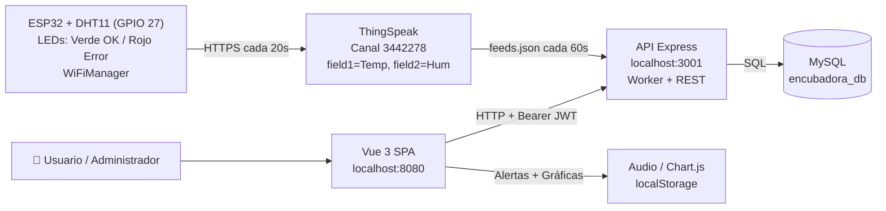
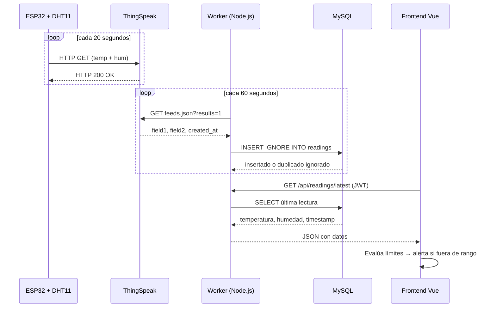
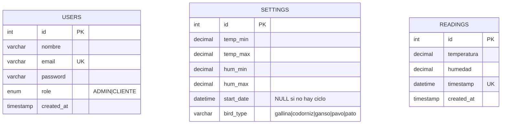

# Arquitectura Técnica — Incubadora ESP32

**Última actualización:** 6 de octubre de 2026

## Propósito y Alcance

El sistema permite a usuarios autenticados consultar en tiempo real la temperatura y humedad de una incubadora, revisar el historial con gráficas, recibir alertas visuales y sonoras, y consultar guías de incubación por tipo de ave. Un administrador gestiona usuarios, configura umbrales de alarma y controla el ciclo de incubación.

El origen de telemetría es un **ESP32 con sensor DHT11** que publica lecturas en **ThingSpeak** cada 20 segundos. El firmware (`codigoesp32.ino`) está versionado en la raíz del repositorio.

---

## Diagrama de Componentes

---

## Capas del Sistema

| Capa | Tecnología | Responsabilidad |
|------|-----------|----------------|
| **Hardware / Firmware** | ESP32, DHT11, WiFiManager, ThingSpeak lib | Lectura de sensor, conexión Wi-Fi y publicación de telemetría |
| **Integración externa** | ThingSpeak (Canal 3442278) | Recibe y expone temperatura (`field1`) y humedad (`field2`) |
| **Ingesta (Worker)** | Node.js `setInterval` + Axios | Consulta ThingSpeak cada 60s e inserta lecturas nuevas en MySQL |
| **API REST** | Express, jsonwebtoken, bcrypt | Autenticación, autorización por rol, CRUD usuarios, settings, lecturas |
| **Base de datos** | MySQL con `mysql2/promise` | Persiste usuarios, configuración global y lecturas históricas |
| **Interfaz web** | Vue 3, Vue Router, Axios, Chart.js, Tailwind CSS | Dashboard en tiempo real, alertas, gestión de usuarios y ciclos |

---

## Flujo de Telemetría

---

## Indicador de Estado del ESP32

El frontend calcula automáticamente si el ESP32 está activo:

- **🟢 En Línea:** la última lectura fue hace **≤ 3 minutos**.
- **🔴 Desconectado:** la última lectura fue hace **> 3 minutos**.

El indicador aparece en la barra de navegación del Dashboard con animación de pulso cuando está activo.

---

## Modelo de Datos

> `settings` usa una única fila (`id = 1`). El ciclo y la configuración son globales para toda la aplicación.

---

## API REST Completa

| Método | Ruta | Auth | Descripción |
|--------|------|------|-------------|
| `POST` | `/api/login` | ❌ Pública | Valida credenciales → emite JWT 24h |
| `GET` | `/api/users` | ADMIN | Lista todos los usuarios |
| `POST` | `/api/users` | ADMIN | Crea usuario con contraseña hasheada (bcrypt) |
| `PUT` | `/api/users/:id` | ADMIN | **Edita** nombre, email, rol y contraseña opcional |
| `DELETE` | `/api/users/:id` | ADMIN | Elimina usuario |
| `GET` | `/api/settings` | Autenticado | Obtiene umbrales de alarma y estado del ciclo |
| `POST` | `/api/settings` | ADMIN | Actualiza umbrales de temperatura y humedad |
| `POST` | `/api/settings/start` | ADMIN | Inicia ciclo → guarda `start_date` y `bird_type` |
| `POST` | `/api/settings/stop` | ADMIN | Finaliza ciclo → `start_date = NULL` |
| `GET` | `/api/readings` | Autenticado | Lista lecturas paginadas (`?page=1&limit=20`) |
| `GET` | `/api/readings/latest` | Autenticado | Retorna la lectura más reciente |

---

## Despliegue Local

| Servicio | Comando | Puerto |
|---------|---------|--------|
| MySQL (XAMPP) | XAMPP Control Panel → Start MySQL | 3306 |
| Backend API | `node backend/index.js` | 3001 |
| Frontend | `npm run dev` (raíz) | 8080 |
| Inicio automático | `iniciar_sistema.bat` | — |

---

## Firmware ESP32

| Parámetro | Valor |
|-----------|-------|
| Archivo | `codigoesp32.ino` |
| Sensor | DHT11 en **GPIO 27** |
| LED Verde | GPIO 26 (envío exitoso) |
| LED Rojo | GPIO 25 (lectura / error) |
| Gestión Wi-Fi | WiFiManager (AP: `ESP32-DHT11`, clave: `12345678`) |
| Canal ThingSpeak | `3442278` |
| Frecuencia de envío | Cada **20 segundos** |

---

## Decisiones Técnicas Pendientes

1. **Variables de entorno:** mover JWT secret, claves ThingSpeak y credenciales MySQL a `.env`.
2. **CORS:** restringir a `http://localhost:8080` (o dominio de producción).
3. **URL de API:** centralizar en variable `VITE_API_URL` en el frontend.
4. **Escalabilidad:** modelar entidades `Incubadora` y `Ciclo` para soportar más de una unidad.
