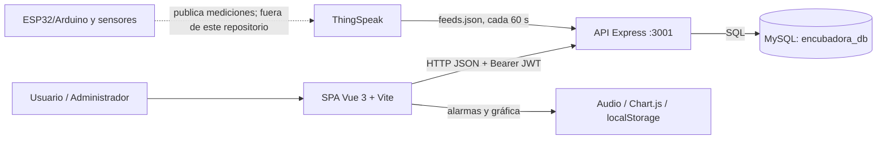
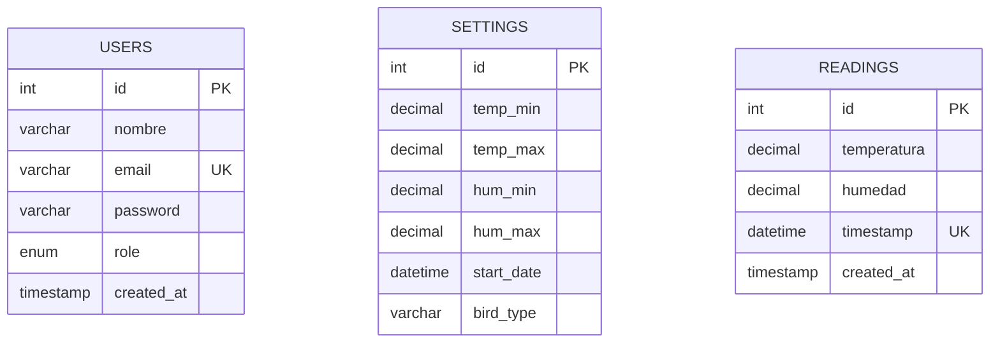

# Arquitectura técnica

## Propósito y alcance actual

El sistema permite a usuarios autenticados consultar temperatura y humedad de una incubadora, revisar su historial y recibir alertas visuales/sonoras. Un administrador también administra usuarios, configura límites y controla el inicio o detención de un ciclo de incubación.

El origen de telemetría configurado es un canal de ThingSpeak. No existe en el repositorio código de Arduino/ESP32, sensores, actuadores ni control físico de calefacción, humedad o volteo.

## Componentes

| Capa | Tecnología | Responsabilidad |
| --- | --- | --- |
| Interfaz | Vue 3, Vue Router, Axios, Chart.js | Inicio de sesión, dashboard, gráficas, alertas y administración. |
| API | Node.js, Express, CORS | Autenticación, autorización por rol, CRUD de usuarios, parámetros y lecturas. |
| Ingesta | Axios + tarea `setInterval` | Consulta la última lectura de ThingSpeak al iniciar y cada minuto. |
| Datos | MySQL con `mysql2/promise` | Conserva usuarios, configuración global y lecturas históricas. |
| Integración externa | ThingSpeak | Expone la última temperatura (`field1`) y humedad (`field2`). |

## Flujo de telemetría

1. Un dispositivo externo publica valores en ThingSpeak (integración no incluida).
2. `backend/index.js` llama al endpoint `feeds.json` con `results=1` cada 60 segundos.
3. Si existen `field1` y `field2`, la API los convierte a números y almacena la lectura en `readings`.
4. La restricción única sobre `readings.timestamp` evita repetir una misma muestra.
5. El dashboard solicita la última lectura y el historial paginado cada minuto; determina localmente si está fuera de los límites guardados en `settings`.

## Modelo de datos

`settings` usa una única fila (`id = 1`), por lo que la configuración y el ciclo son globales: no se relacionan con una incubadora, usuario o lote específico.

## API disponible

| Método y ruta | Autorización | Función |
| --- | --- | --- |
| `POST /api/login` | Pública | Valida credenciales y emite JWT de 24 horas. |
| `GET /api/users` | ADMIN | Lista usuarios. |
| `POST /api/users` | ADMIN | Crea un usuario y cifra la contraseña con bcrypt. |
| `DELETE /api/users/:id` | ADMIN | Elimina un usuario. |
| `GET /api/settings` | Autenticado | Obtiene rangos y ciclo global. |
| `POST /api/settings` | ADMIN | Actualiza límites de temperatura y humedad. |
| `POST /api/settings/start` | ADMIN | Inicia ciclo y define tipo de ave. |
| `POST /api/settings/stop` | ADMIN | Finaliza el ciclo activo. |
| `GET /api/readings` | Autenticado | Lista lecturas paginadas (`page`, `limit`). |
| `GET /api/readings/latest` | Autenticado | Recupera la lectura más reciente. |

## Despliegue y configuración actual

- Frontend: `npm run dev` / `npm run build` desde la raíz.
- Backend: no tiene script `start`; se ejecuta con `node backend/index.js` tras instalar dependencias en `backend/`.
- Base de datos: ejecutar `init.sql`, `settings.sql` y luego `alter.sql` sobre MySQL.
- Frontend y backend están acoplados a `http://localhost:3001`.
- La conexión MySQL está fijada a `localhost`, usuario `root`, contraseña vacía y base `encubadora_db`.

## Restricciones y decisiones para la siguiente iteración

1. Mover secretos, credenciales de MySQL y configuración de ThingSpeak a variables de entorno; rotar las claves actualmente expuestas.
2. Centralizar la URL de API en una variable `VITE_API_URL`.
3. Modelar incubadoras, lotes y ciclos como entidades independientes antes de soportar más de un equipo.
4. Incorporar firmware versionado, contrato de telemetría y autenticación de dispositivo si el alcance incluye el hardware.
