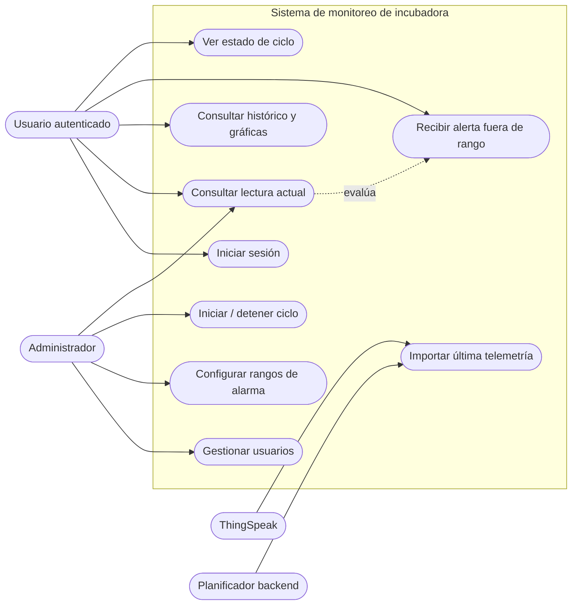

# Casos de uso

## Actores

| Actor | Descripción |
| --- | --- |
| Usuario autenticado | Consulta el estado y el historial de la incubadora. |
| Administrador | Usuario con permisos para gestionar usuarios, rangos y ciclos. |
| ThingSpeak | Sistema externo que entrega la última telemetría. |
| Planificador del backend | Proceso interno que consulta ThingSpeak cada minuto. |

## Diagrama de casos de uso

## Especificación resumida

| ID | Caso de uso | Actor principal | Precondición | Resultado |
| --- | --- | --- | --- | --- |
| CU-01 | Iniciar sesión | Usuario | Cuenta existente | Se guarda JWT y se abre el dashboard. |
| CU-02 | Consultar estado | Usuario | JWT válido | Se muestran última temperatura, humedad y rangos. |
| CU-03 | Consultar histórico | Usuario | JWT válido | Se muestra tabla paginada y gráficas de 20 lecturas. |
| CU-04 | Recibir alerta | Usuario | Lectura disponible y fuera de rango | Se resaltan métricas, aparece aviso y se reproduce alarma local. |
| CU-05 | Gestionar usuarios | Administrador | JWT con rol `ADMIN` | Se crean, listan o eliminan usuarios. |
| CU-06 | Configurar límites | Administrador | JWT con rol `ADMIN` | Se actualizan límites globales de temperatura y humedad. |
| CU-07 | Gestionar ciclo | Administrador | JWT con rol `ADMIN` | Se inicia/detiene un ciclo y se conserva tipo de ave y fecha. |
| CU-08 | Importar telemetría | Planificador backend | Credencial ThingSpeak válida | Se persiste una lectura nueva si el timestamp no existe. |

## Reglas de negocio implementadas

- Solo el administrador puede modificar usuarios, límites y ciclo.
- Las lecturas fuera de los rangos configurados activan una alerta en el navegador; silenciarla no cambia la configuración ni se persiste.
- Para gallina, el dashboard muestra aviso de días 18–21 si existe un ciclo activo. Para otras aves hay guía de referencia, pero no alertas de fase implementadas.
- El estado del ciclo es único para toda la aplicación.
