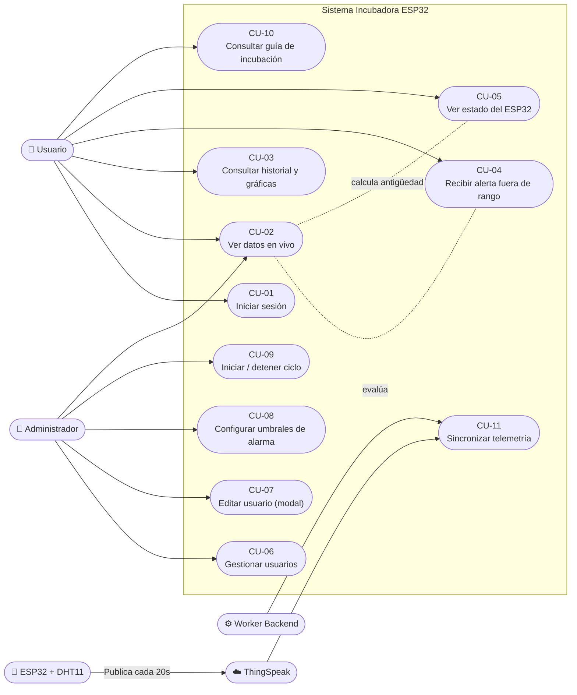

# Casos de Uso — Incubadora ESP32

**Última actualización:** 6 de octubre de 2026

## Actores

| Actor | Descripción |
|-------|-------------|
| **Usuario (CLIENTE)** | Usuario autenticado que consulta el estado e historial de la incubadora. |
| **Administrador (ADMIN)** | Usuario con permisos para gestionar usuarios, umbrales, ciclos y configuración. |
| **ESP32 + DHT11** | Hardware que mide temperatura y humedad y publica en ThingSpeak. |
| **ThingSpeak** | Plataforma IoT en la nube que almacena y expone la telemetría del ESP32. |
| **Worker (Backend)** | Proceso interno que sincroniza ThingSpeak → MySQL cada 60 segundos. |

---

## Diagrama de Casos de Uso

---

## Especificación de Casos de Uso

| ID | Caso de Uso | Actor Principal | Precondición | Resultado |
|----|-------------|----------------|--------------|-----------|
| CU-01 | Iniciar sesión | Usuario | Cuenta existente en la BD | Se emite JWT, se guarda en `localStorage` y se redirige al Dashboard |
| CU-02 | Ver datos en vivo | Usuario | JWT válido | Se muestran temperatura, humedad, rango ideal y badge Normal/Crítico |
| CU-03 | Consultar historial y gráficas | Usuario | JWT válido | Tabla paginada (20 reg/pág) + gráficas Chart.js de temperatura y humedad |
| CU-04 | Recibir alerta fuera de rango | Usuario | Lectura disponible y fuera de umbral | Card con `ring` rojo + `animate-pulse`, alarma sonora en bucle, botón silenciar |
| CU-05 | Ver estado del ESP32 | Usuario | Última lectura en BD | Indicador 🟢 En Línea (≤3 min) o 🔴 Desconectado (>3 min) en el navbar |
| CU-06 | Gestionar usuarios | Administrador | JWT con rol `ADMIN` | Listar, crear y eliminar usuarios; protección del ID=1 |
| CU-07 | Editar usuario (modal) | Administrador | JWT con rol `ADMIN` | Modal con nombre, email, rol y contraseña opcional; actualiza vía `PUT /api/users/:id` |
| CU-08 | Configurar umbrales | Administrador | JWT con rol `ADMIN` | Se actualizan temp min/max y hum min/max en `settings`; Dashboard refleja cambio en 60s |
| CU-09 | Iniciar / Detener ciclo | Administrador | JWT con rol `ADMIN` | Se guarda/borra `start_date` y `bird_type`; Dashboard muestra contador de días |
| CU-10 | Consultar guía de incubación | Usuario | JWT válido | Tabs por ave (Gallina, Codorniz, Ganso, Pavo, Pato) con tabla diaria de temperatura/humedad/acciones |
| CU-11 | Sincronizar telemetría | Worker Backend | ThingSpeak accesible | `INSERT IGNORE` de última lectura en `readings`; evita duplicados por timestamp único |

---

## Reglas de Negocio Implementadas

1. **Solo ADMIN** puede crear, editar, eliminar usuarios y cambiar configuración o ciclos.
2. **El usuario con ID=1** (Administrador inicial) no puede ser eliminado desde la UI.
3. Las alertas de rango (temperatura/humedad) son **locales al navegador**: no se persisten en BD ni se notifican remotamente.
4. El indicador **Online/Offline del ESP32** se calcula como: `now() - lastReading.timestamp ≤ 3 minutos`.
5. Al **editar un usuario**, si el campo contraseña se deja vacío, la contraseña actual no se modifica.
6. El ciclo de incubación es **global** para toda la aplicación (una sola incubadora).
7. Para la **gallina**, el sistema emite una alerta de multimedia en días 18–21 si hay ciclo activo.
