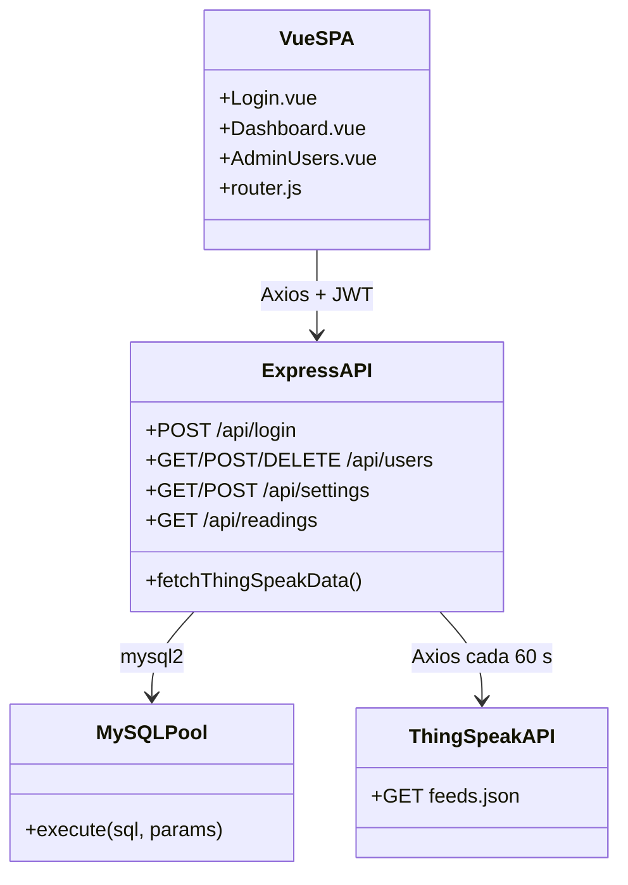
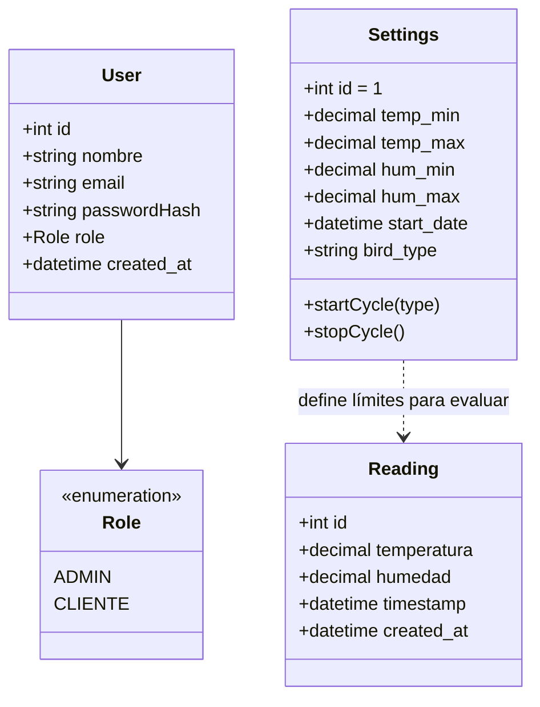
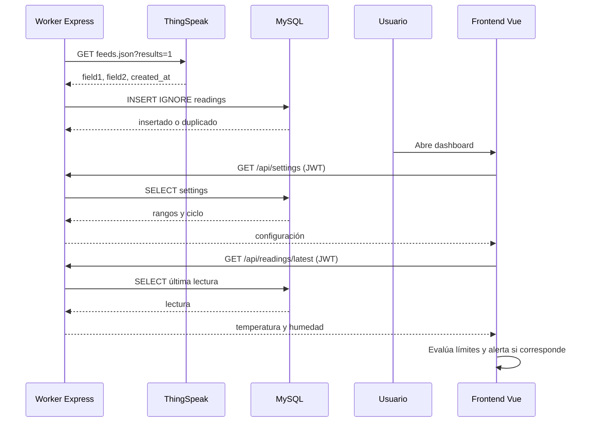
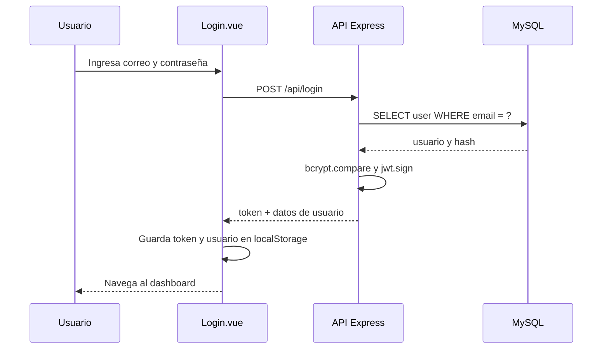

# Diagramas UML

## Diagrama de componentes

```mermaid
classDiagram
  class VueSPA {
    +Login.vue
    +Dashboard.vue
    +AdminUsers.vue
    +router.js
  }
  class ExpressAPI {
    +POST /api/login
    +GET/POST/DELETE /api/users
    +GET/POST /api/settings
    +GET /api/readings
    +fetchThingSpeakData()
  }
  class MySQLPool {
    +execute(sql, params)
  }
  class ThingSpeakAPI {
    +GET feeds.json
  }
  VueSPA --> ExpressAPI : Axios + JWT
  ExpressAPI --> MySQLPool : mysql2
  ExpressAPI --> ThingSpeakAPI : Axios cada 60 s
```

## Modelo de dominio

```mermaid
classDiagram
  class User {
    +int id
    +string nombre
    +string email
    +string passwordHash
    +Role role
    +datetime created_at
  }
  class Settings {
    +int id = 1
    +decimal temp_min
    +decimal temp_max
    +decimal hum_min
    +decimal hum_max
    +datetime start_date
    +string bird_type
    +startCycle(type)
    +stopCycle()
  }
  class Reading {
    +int id
    +decimal temperatura
    +decimal humedad
    +datetime timestamp
    +datetime created_at
  }
  class Role {
    <<enumeration>>
    ADMIN
    CLIENTE
  }
  User --> Role
  Settings ..> Reading : define límites para evaluar
```

## Secuencia: incorporación y visualización de una lectura

```mermaid
sequenceDiagram
  participant W as Worker Express
  participant T as ThingSpeak
  participant D as MySQL
  participant U as Usuario
  participant F as Frontend Vue
  W->>T: GET feeds.json?results=1
  T-->>W: field1, field2, created_at
  W->>D: INSERT IGNORE readings
  D-->>W: insertado o duplicado
  U->>F: Abre dashboard
  F->>W: GET /api/settings (JWT)
  W->>D: SELECT settings
  D-->>W: rangos y ciclo
  W-->>F: configuración
  F->>W: GET /api/readings/latest (JWT)
  W->>D: SELECT última lectura
  D-->>W: lectura
  W-->>F: temperatura y humedad
  F->>F: Evalúa límites y alerta si corresponde
```

## Secuencia: autenticación

```mermaid
sequenceDiagram
  participant U as Usuario
  participant F as Login.vue
  participant A as API Express
  participant D as MySQL
  U->>F: Ingresa correo y contraseña
  F->>A: POST /api/login
  A->>D: SELECT user WHERE email = ?
  D-->>A: usuario y hash
  A->>A: bcrypt.compare y jwt.sign
  A-->>F: token + datos de usuario
  F->>F: Guarda token y usuario en localStorage
  F-->>U: Navega al dashboard
```
