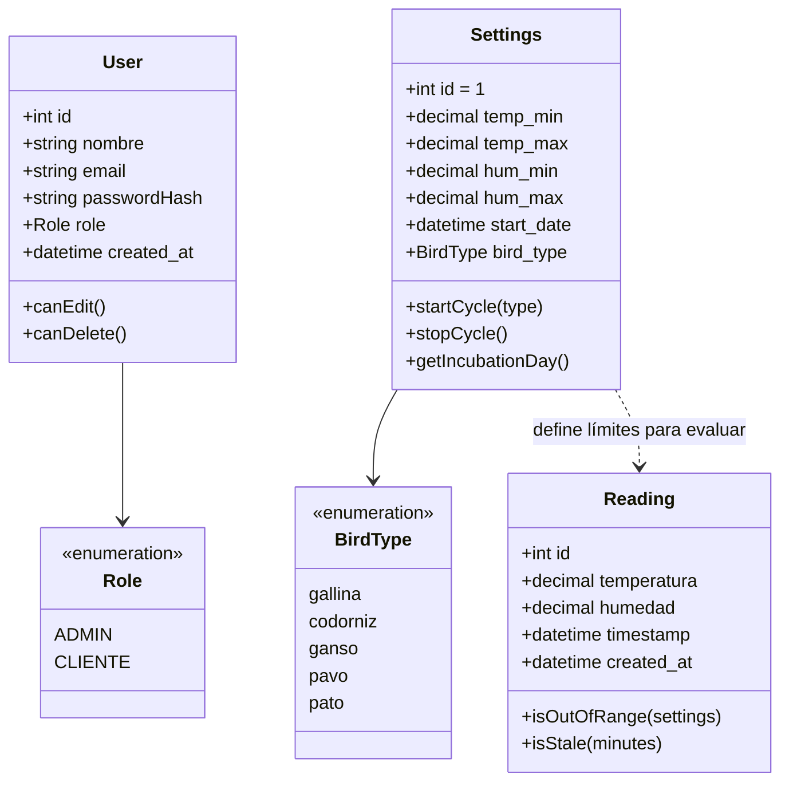
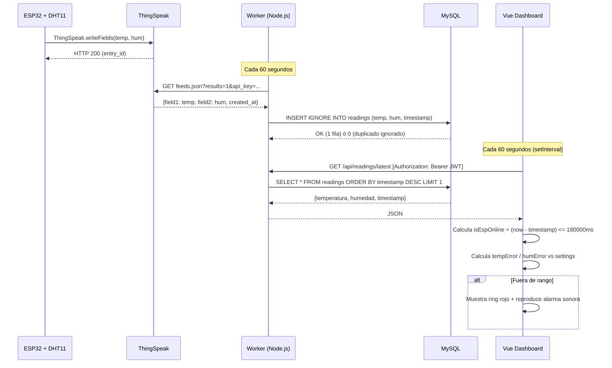
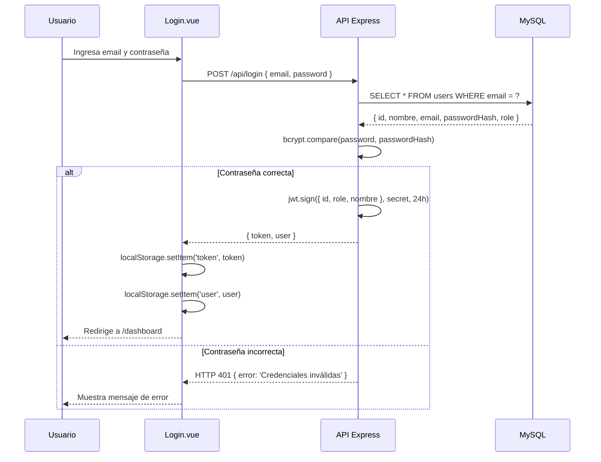

# Diagramas UML — Incubadora ESP32

**Última actualización:** 6 de octubre de 2026

---

## 1. Diagrama de Componentes

```mermaid
classDiagram
  class ESP32 {
    +DHT11 sensor (GPIO 27)
    +LED Verde (GPIO 26)
    +LED Rojo (GPIO 25)
    +WiFiManager
    +sendToThingSpeak() cada 20s
  }
  class ThingSpeak {
    +channelID: 3442278
    +field1: temperatura
    +field2: humedad
    +GET feeds.json
  }
  class WorkerNode {
    +setInterval(60000ms)
    +fetchThingSpeakData()
    +INSERT IGNORE readings
  }
  class ExpressAPI {
    +POST /api/login
    +GET /api/users
    +POST /api/users
    +PUT /api/users/:id
    +DELETE /api/users/:id
    +GET /api/settings
    +POST /api/settings
    +POST /api/settings/start
    +POST /api/settings/stop
    +GET /api/readings
    +GET /api/readings/latest
  }
  class MySQLDB {
    +table: users
    +table: settings
    +table: readings
    +execute(sql, params)
  }
  class VueSPA {
    +Login.vue
    +Dashboard.vue
    +AdminUsers.vue
    +router.js (guardias JWT)
    +main.js (interceptor 401)
  }

  ESP32 -->|HTTPS POST cada 20s| ThingSpeak
  ThingSpeak -->|feeds.json| WorkerNode
  WorkerNode -->|INSERT IGNORE| MySQLDB
  WorkerNode --> ExpressAPI : embebido
  ExpressAPI -->|mysql2| MySQLDB
  VueSPA -->|Axios + Bearer JWT| ExpressAPI
```

---

## 2. Modelo de Dominio



---

## 3. Secuencia: Ciclo Completo de una Lectura



---

## 4. Secuencia: Autenticación



---

## 5. Secuencia: Editar Usuario (Modal)

```mermaid
sequenceDiagram
  participant Admin as Administrador
  participant FE as AdminUsers.vue
  participant API as Express API
  participant DB as MySQL

  Admin->>FE: Clic en "Editar" (fila de usuario)
  FE->>FE: openEditModal(user) → copia datos, password=""
  FE-->>Admin: Muestra modal con campos prellenados

  Admin->>FE: Modifica nombre / email / rol / contraseña (opcional)
  Admin->>FE: Clic "Guardar Cambios"
  FE->>API: PUT /api/users/:id { nombre, email, role, password }

  alt Con nueva contraseña
    API->>API: bcrypt.hash(password, 10)
    API->>DB: UPDATE users SET nombre,email,password,role WHERE id=?
  else Sin contraseña (campo vacío)
    API->>DB: UPDATE users SET nombre,email,role WHERE id=?
  end

  DB-->>API: OK
  API-->>FE: { message: 'Usuario actualizado' }
  FE->>FE: showEditModal = false; fetchUsers()
  FE-->>Admin: Tabla actualizada
```
